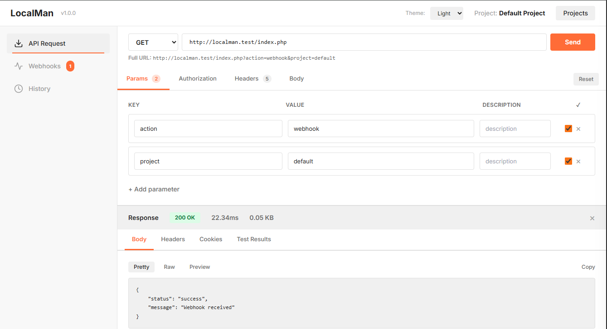
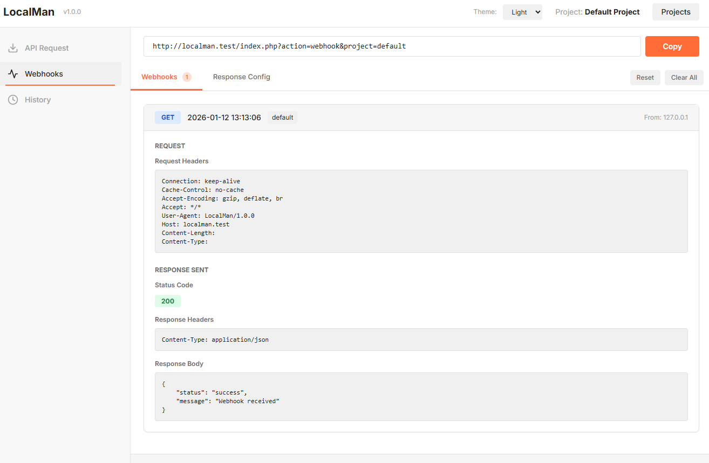

# 🚀 LocalMan

A Postman-like standalone PHP application that runs as a single file. Send API requests, capture webhooks, and manage multiple projects - all in one simple, beautiful interface optimized for local development!

## ✨ Features

### 📤 API Request Testing
- **Multiple HTTP Methods**: GET, POST, PUT, PATCH, and DELETE
- **Query Parameters**: Add, enable/disable parameters with live URL preview
- **Authorization**: Support for Bearer tokens and Basic auth
- **Custom Headers**: Key-value pairs with enable/disable toggles
- **Request Body Types**:
  - Raw (JSON, XML, text, etc.)
  - Form data (multipart/form-data with file uploads)
  - URL-encoded (x-www-form-urlencoded)
- **File Uploads**: Base64-encoded file support in form-data requests
- **Real-time Response**: View status codes, headers, body, and response times
- **⭐ Saved Requests**: Star and save frequently used requests per project
- **Request State**: Each project remembers your last request configuration

### 📨 Webhook Testing
- **Per-Project Webhook URLs**: Each project gets its own webhook endpoint
- **Configurable Responses**: Set custom status codes, headers, and body for webhook responses
- **Auto-Reload**: Webhook page refreshes every 2 seconds to show new captures
- **Detailed Capture**: See request method, headers, query params, body, and IP address
- **Unread Badges**: Visual indicators for new webhooks per project

### 🔄 Webhook Relay (NEW in v1.1.0)
- **Public Webhook URLs**: Receive webhooks from external services via public URLs
- **Local Relay**: Automatically forward webhooks to your local development environment
- **Auto-Polling**: Checks for new webhooks every 5 seconds
- **Pause/Resume**: Control automatic polling as needed
- **Multiple Relays**: Create multiple webhook relays per project
- **Error Handling**: See relay failures and retry manually
- **Stats Tracking**: Monitor relay count, errors, and timestamps
- **Enable/Disable**: Toggle relays on/off without deleting

### 🗂️ Project Management
- **Multiple Projects**: Organize your API testing into separate projects
- **Isolated Histories**: Each project tracks its own requests and webhooks
- **Project Switching**: Easy dropdown to switch between projects
- **Persistent Settings**: Each project remembers last request configuration
- **Custom Webhook Responses**: Configure different webhook responses per project

### 📝 History Tracking
- **Request History**: All sent API requests with full details
- **Webhook History**: All captured webhooks with timestamps
- **Last 50 Entries**: Automatically maintains recent history
- **Project-Specific**: Filter history by current project

### 🎨 User Interface
- **Dark/Light Mode**: Auto-detect, manual dark, or light theme
- **Modern Design**: Clean Postman-inspired interface with Tailwind CSS
- **Responsive Layout**: Works on all screen sizes
- **Real-time Updates**: Live webhook count badges
- **Auto-Update Checker**: Checks GitHub for new versions (every 24 hours)

### 💾 Storage & Data
- **File-Based Storage**: No database required, uses JSON files
- **Persistent State**: Settings saved between sessions
- **Auto-Cleanup**: Keeps last 50 entries per project/type
- **Thread-Safe**: File locking prevents race conditions
- **UTC Timestamps**: Consistent timezone across systems

## 📋 Requirements

- PHP 7.4 or higher
- cURL extension enabled
- JSON extension enabled (usually enabled by default)
- Write permissions for the application directory
- Recommended: Error logging enabled for debugging

## 🚀 Quick Start

1. **Clone or download**
   ```bash
   git clone https://github.com/madanielsen/localman.git
   cd localman
   ```

2. **Start PHP built-in server**
   ```bash
   php -S localhost:8000
   ```

3. **Open in browser**
   ```
   http://localhost:8000
   ```

That's it! LocalMan will automatically create storage directories on first run.

## 📖 Detailed Usage

### 🔧 Sending API Requests



1. **Select HTTP Method**: Choose GET, POST, PUT, PATCH, or DELETE
2. **Enter URL**: Type or paste your API endpoint
3. **Add Query Parameters** (Optional):
   - Click "Add Parameter"
   - Enter key and value
   - Toggle checkbox to enable/disable
   - See live URL preview with parameters
4. **Add Authorization** (Optional):
   - None: No authentication
   - Bearer Token: JWT or OAuth tokens
   - Basic Auth: Username and password
5. **Add Custom Headers** (Optional):
   - Click "Add Header"
   - Enter header name and value
   - Example: `X-API-Key: your-api-key`
6. **Configure Request Body** (for POST/PUT/PATCH):
   - **None**: No body
   - **Form Data**: Multipart form with text fields and file uploads
   - **URL Encoded**: x-www-form-urlencoded format
   - **Raw**: JSON, XML, or plain text
7. **Click Send Request**
8. **View Response**:
   - Body tab: See response content (auto-formatted JSON)
   - Headers tab: View response headers
   - Status code and response time shown at top

### 📨 Webhook Testing



#### Setup
1. Navigate to **Webhooks** tab
2. Copy the webhook URL shown at the top
   - Format: `http://localhost:8000/index.php?action=webhook&project=YOUR_PROJECT`
3. Configure your service to send webhooks to this URL

#### Configure Webhook Response
1. Click **Response Config** tab
2. Set **Status Code** (e.g., 200, 201, 400)
3. Add **Response Headers**:
   - Example: `Content-Type: application/json`
4. Enter **Response Body**:
   - Example: `{"status": "received", "processed": true}`
5. Click **Save Configuration**

Now when webhooks arrive, they'll receive your custom response!

#### View Captured Webhooks
1. The **Webhooks** tab shows all incoming webhooks
2. Auto-refreshes every 2 seconds
3. Each webhook shows:
   - HTTP method (GET, POST, etc.)
   - Timestamp
   - Source IP address
   - Query parameters
   - Request headers
   - Request body (auto-formatted if JSON)
   - Response sent (status, headers, body)

### � Webhook Relay (v1.1.0+)

Webhook Relay allows you to receive webhooks from external services (like GitHub, Stripe, etc.) and automatically forward them to your local development environment. This is perfect for testing webhook integrations without exposing your localhost to the internet or using ngrok.


#### How It Works
1. You create a webhook relay in LocalMan
2. LocalMan gives you a public URL hosted at `api.localman.io`
3. You configure the external service to send webhooks to that public URL
4. LocalMan automatically polls the API and forwards webhooks to your local URL
5. You receive the webhook in your local development environment

#### Creating a Relay
1. Navigate to **Relay** tab
2. Click **Create New Relay**
3. Enter your **Local Webhook URL** (e.g., `http://localhost:3000/webhooks`)
   - Must be a valid URL
   - Can be any endpoint on your local machine
4. Click **Create Relay**
5. Copy the **Public Webhook URL** provided
6. Configure your external service (GitHub, Stripe, etc.) to send webhooks to this public URL

#### Managing Relays
- **Enable/Disable**: Toggle relays on/off with the switch
  - Disabled relays won't poll for new webhooks
  - Useful when you need to temporarily pause testing
- **Delete**: Remove relays you no longer need
- **Pause/Resume Polling**: Control automatic polling with the pause button
  - Polling occurs every 5 seconds when active
  - Paused relays won't check for new webhooks
- **Manual Check**: Click "Check Now" to immediately poll for new webhooks
- **Relay Now**: Manually retry failed relays

#### Relay Status
Each relay shows:
- **Public URL**: The webhook endpoint hosted by api.localman.io
- **Local URL**: Where webhooks are forwarded to
- **Status**: Enabled/Disabled
- **Relayed Count**: Number of webhooks successfully forwarded
- **Last Polled**: Timestamp of last check
- **Errors**: Any relay failures or API errors
- **Polling Status**: Whether auto-polling is active or paused

#### Webhook Flow
1. External service sends webhook to public URL (`api.localman.io/w/{uuid}`)
2. LocalMan polls API every 5 seconds
3. New webhooks are detected
4. LocalMan forwards webhook to your local URL
5. LocalMan marks webhook as relayed
6. Relay count updates

#### Error Handling
If a relay fails:
- Error message shown on relay card
- Can manually retry with "Relay Now" button
- Check that local URL is accessible
- Verify local service is running

#### Important Notes
- Public URLs are generated by the LocalMan API
- Webhooks are stored on the API for 60 days
- Rate limit: One poll per relay every 4 seconds
- Polling happens every 5 seconds when enabled and not paused
- Relays are stored per project
- No authentication required (UUID-based security)

### �🗂️ Managing Projects

#### Why Projects?
Projects let you organize different APIs or environments (dev, staging, prod) with separate:
- Webhook URLs
- Webhook response configurations
- Request histories
- Saved request states

#### Create Project
1. Click the **Projects** dropdown (top-left)
2. Click **Manage Projects**
3. Enter project name in "Create New Project"
4. Click **Create**

#### Switch Projects
1. Click the **Projects** dropdown
2. Select project from list
3. Current project shown with checkmark

#### Project Features
- Each project has its own webhook URL with project parameter
- Webhook responses configured per project
- Last 50 webhooks per project
- Last 50 requests per project
- Projects persist between sessions

### 📝 History

#### Request History
- View in **History** tab
- Shows all sent API requests for current project
- Displays: Method, URL, Status Code, Duration, Timestamp
- Click **Clear All** to remove history

#### Webhook History
- View in **Webhooks** tab under webhooks list
- Shows all captured webhooks for current project
- Auto-reloads to show new captures
- Click **Clear All** to remove history

### 🎨 Theme Settings

1. Click **Theme** dropdown (top-right)
2. Choose:
   - **Auto**: Uses system preference
   - **Light**: Always light theme
   - **Dark**: Always dark theme
3. Theme persists between sessions

### 🔄 Auto-Update

LocalMan checks GitHub for updates every 24 hours. When available:
1. Yellow banner appears at top
2. Click **Auto Update** to install
3. Creates backups: `index.php.backup` and `localman.settings.json.backup`
4. Downloads latest version from GitHub
5. Page reloads with new version
6. ⚠️ Settings reset to defaults after update (restore from backup if needed)

## 🗂️ File Structure

```
localman/
├── index.php                          # Main application (single file)
└── storage/                           # Auto-created on first run
    ├── localman.settings.json        # App settings & projects
    ├── webhooks/                      # Webhook captures
    │   └── *.json                     # Individual webhook files
    └── requests/                      # Request history
        └── *.json                     # Individual request files
```

### Storage Details

**Settings File** (`storage/localman.settings.json`):
```json
{
  "darkMode": "auto|light|dark",
  "currentProject": "default",
  "lastVersionCheck": 1234567890,
  "projects": {
    "default": {
      "name": "Default Project",
      "webhookResponse": { ... },
      "lastRequest": { ... },
      "webhookRelays": [],
      "webhookRelaySettings": {
        "autoPoll": true
      }
    }
  }
}
```

**Webhook Relays**:
- Each project has its own webhook relays
- `webhookRelays`: Array of relay configurations
- `webhookRelaySettings`: Per-project relay settings (auto-polling)
- Relays include: UUID, public URL, local URL, enabled status, stats

**Data Management**:
- Automatically keeps last 50 webhooks per project
- Automatically keeps last 50 requests per project  
- Files named with microtime timestamp + unique ID
- Old entries auto-deleted when limit exceeded
- All timestamps in UTC for consistency

## 🎨 Technology Stack

- **Backend**: PHP 7.4+ with cURL extension
- **Frontend**: Vanilla JavaScript (no frameworks)
- **Styling**: Tailwind CSS 3.x (loaded via CDN)
- **Fonts**: Inter font family from Google Fonts
- **Storage**: JSON file-based (no database)
- **Architecture**: Single-file application (~2850 lines)

## 🔒 Security & Best Practices

### For Local Development
LocalMan is designed for **local development only** and includes:
- ✅ File locking to prevent race conditions
- ✅ Error handling and logging
- ✅ Input validation for status codes
- ✅ JSON encoding/decoding error checks
- ✅ Proper temp file cleanup
- ✅ UTC timestamps for consistency

### Important Notes
- **Not production-ready**: No authentication built-in
- **Local use only**: Don't expose to public internet
- **No CSRF protection**: Designed for localhost
- **File permissions**: Ensure write access to storage directory
- **Rate limiting**: None (not needed for local dev)

### If You Must Expose Publicly
Consider adding:
1. HTTP Basic Authentication via `.htaccess` or web server config
2. IP whitelist restrictions
3. Move outside web root and use symlink
4. Regular backup of storage directory

## 🤝 Contributing

Contributions welcome! This is a single-file application meant to stay simple and hackable.

### Development
- All code in `index.php` (PHP + HTML + CSS + JS)
- No build process or dependencies
- Follow existing code style
- Test locally before submitting PR

## 📄 License

MIT License - feel free to use, modify, and distribute.

## 💡 Common Use Cases

### API Development
- Test REST API endpoints during development
- Verify request/response formats
- Debug authentication issues
- Test error handling

### Webhook Integration
- Develop webhook receivers locally (e.g., Stripe, PayPal, GitHub)
- Inspect webhook payload formats
- Test webhook response codes
- Debug webhook failures without deploying

### Third-Party API Exploration
- Explore new APIs without writing code
- Test authentication methods
- Understand API responses
- Save request configurations for reuse

### Team Development
- Share API collections via projects
- Test different environments (dev/staging)
- Document API behavior
- Isolate testing per feature/project

### Learning & Education
- Understand HTTP methods and status codes
- Learn about headers and authentication
- See real-time API interactions
- Practice with webhooks safely

## 🎯 Why LocalMan?

| Feature | LocalMan | Postman | Insomnia | cURL |
|---------|----------|---------|----------|------|
| **Installation** | Single PHP file | Desktop app | Desktop app | Pre-installed |
| **Webhook Capture** | ✅ Built-in | ❌ Need tunnel | ❌ Need tunnel | ❌ Manual |
| **Webhook Relay** | ✅ Built-in (v1.1.0+) | ❌ Need tunnel | ❌ Need tunnel | ❌ Manual |
| **Projects** | ✅ Multiple | ✅ Collections | ✅ Workspaces | ❌ No |
| **File Storage** | ✅ JSON files | ☁️ Cloud sync | 💾 Database | ❌ No history |
| **Offline** | ✅ Yes* | ❌ Cloud features | ✅ Yes | ✅ Yes |
| **Learning Curve** | ⚡ Instant | 📚 Moderate | 📚 Moderate | 📚 CLI-based |
| **Customizable** | ✅ One file | ❌ Closed | ❌ Closed | ⚠️ Scripts |
| **Privacy** | ✅ 100% local | ☁️ Cloud sync | 💾 Local DB | ✅ Local |

*Except Tailwind CSS CDN - can be vendored for full offline use

### Perfect For:
- ✅ Quick API testing without installing apps
- ✅ Webhook development on localhost
- ✅ Testing webhooks from external services (GitHub, Stripe, etc.) without ngrok
- ✅ Teams wanting hackable tools
- ✅ Learning HTTP/APIs
- ✅ Environments where you can't install desktop apps
- ✅ Portable testing (USB drive, dropbox, etc.)

### Not Ideal For:
- ❌ Large teams needing collaboration features
- ❌ Complex API test automation
- ❌ Production API monitoring
- ❌ Environments without PHP

## ❓ FAQ

**Q: Can I use this in production?**  
A: LocalMan is designed for local development. If you need production use, add authentication and security hardening.

**Q: Where is my data stored?**  
A: All data is in the `storage/` directory as JSON files. Nothing is sent to cloud services.

**Q: Can I backup my projects?**  
A: Yes! Just copy the `storage/` directory. That's it.

**Q: How do I use custom webhook responses?**  
A: Go to Webhooks tab → Response Config → Set status, headers, body → Save. Each project has its own config.

**Q: Can I import/export projects?**  
A: Currently manual - copy `storage/localman.settings.json` between instances.

**Q: Does it work with GraphQL?**  
A: Yes! Use POST method with raw body type and add `Content-Type: application/json` header.

**Q: File uploads not working?**  
A: Check `upload_max_filesize` and `post_max_size` in your `php.ini` file.

**Q: Webhook not receiving requests?**  
A: Ensure your PHP server is accessible on the network. For external webhooks, use the Webhook Relay feature (v1.1.0+) which provides public URLs.

**Q: How does Webhook Relay work?**  
A: Create a relay to get a public URL at api.localman.io. Configure your external service to send webhooks there. LocalMan polls the API every 5 seconds and forwards webhooks to your local URL.

**Q: Are webhook relays secure?**  
A: Relays use UUID-based URLs with no authentication. Don't share your public URLs publicly. Webhooks are auto-deleted after 60 days.

**Q: Can I use webhook relays in production?**  
A: Webhook Relay is designed for development/testing. For production, use a dedicated webhook service or implement your own infrastructure.

**Q: Can I contribute?**  
A: Yes! Submit PRs for bugs or features. Keep it simple and single-file.

## 🔧 Troubleshooting

### Webhooks not appearing
- Verify webhook URL is correct (includes `?action=webhook&project=NAME`)
- Check PHP error log for issues
- Ensure external service can reach your PHP server

### Webhook Relay issues
- **Relay not working**: 
  - Check that local URL is valid and accessible
  - Ensure local service is running and reachable
  - Verify relay is enabled (toggle switch)
  - Check for error messages on relay card
- **Public URL not receiving webhooks**:
  - Verify external service is configured correctly
  - Check that webhook was sent (external service logs)
  - Ensure api.localman.io is accessible
- **Polling not happening**:
  - Verify auto-polling is not paused (check pause button)
  - Check that relay is enabled
  - Look for API errors in relay card
- **Rate limit errors**:
  - API limits polls to once every 4 seconds per webhook
  - Wait a few seconds and try again
- **Can't create new relay**:
  - Verify local URL is a valid URL format
  - Check for error messages on screen
  - Ensure internet connectivity to api.localman.io

### File permission errors
```bash
chmod -R 755 storage/
```

### JSON errors in settings
- Delete `storage/localman.settings.json` to reset
- Check PHP error log for details

### Request timeout
- Default is 30 seconds
- Edit `REQUEST_TIMEOUT` constant in index.php for longer requests

### Auto-update not working
- Check internet connectivity
- Verify GitHub access isn't blocked
- Check PHP cURL SSL certificate settings

---

Made with ❤️ for developers who want fast, simple, hackable API testing.

**Star the repo** if LocalMan helps you! ⭐
